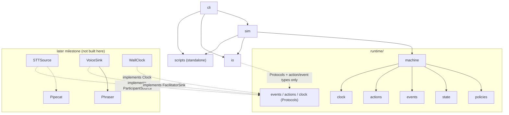
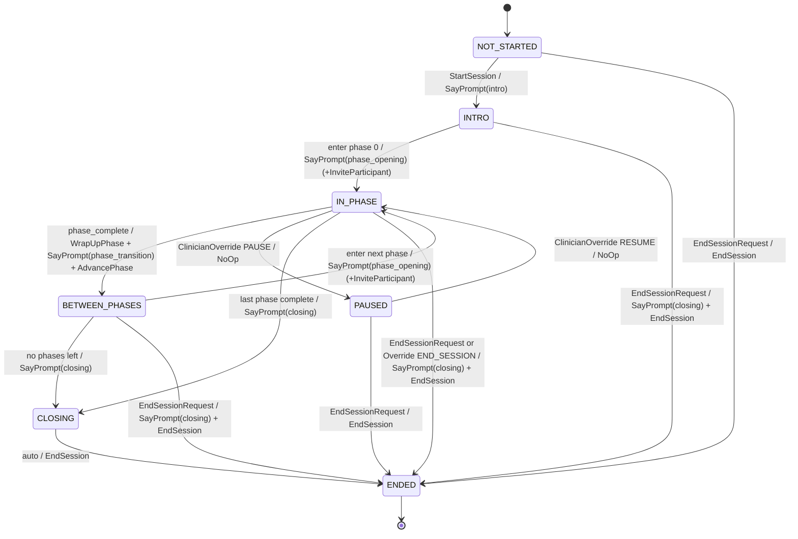
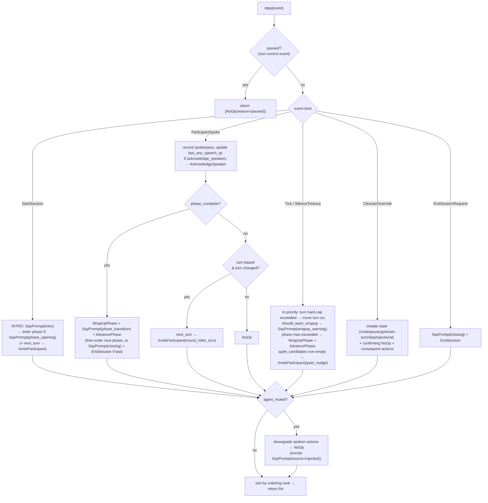
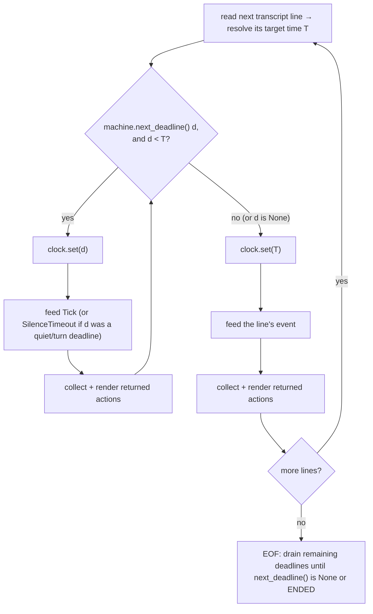
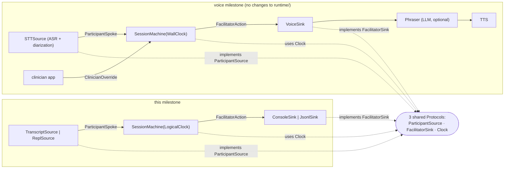

# BrioCare — MVP: Session Scaffolding + Scripting Engine

## Context

BrioCare aims to be a real-time AI voice facilitator for **group therapy sessions for kids**. It augments a human clinician by handling session *mechanics*: turn-taking, prompting quieter participants, and maintaining pace/flow of structured exercises. The clinician supervises and can override at any time.

The project is greenfield (empty repo). Per the user's decision, this first milestone deliberately defers all audio/voice work and builds the **core that voice will later sit on top of**: (1) a declarative "exercise script" format, and (2) a synchronous, deterministic session state machine that executes a script — tracking participants, turns, who has/hasn't spoken, timers — and emits `FacilitatorAction`s. It's exercised through a **text/console simulation** (typed utterances in, facilitator actions out). Voice (STT/TTS/realtime, Pipecat) is a later milestone that will not modify `runtime/`.

**Stack:** Python 3.12+, `pydantic` v2 (schema + state), `PyYAML` (human-authored scripts), `typer` (CLI), `rich` (console output), `pytest` (+ `ruff`, `mypy --strict` on `src/`), `uv` for env/deps. No web frontend. **No `asyncio` in this milestone** — the machine is pulled (event in → actions out), which keeps tests deterministic; async/wall-clock enters only with the voice layer.

## Project layout

```
BrioCare/
  pyproject.toml                # uv; deps: pydantic, pyyaml, typer, rich; dev: pytest, ruff, mypy
  README.md
  src/briocare/
    scripts/
      schema.py                 # ExerciseScript, Phase, Prompt, TurnPolicy, ParticipationPolicy, PacingRule
      loader.py                 # load_script(path) -> ExerciseScript (yaml/json), clean validation errors
      library/feelings_checkin_circle.yaml
    runtime/
      clock.py                  # Clock protocol; LogicalClock (sim/tests); WallClock (future)
      events.py                 # InputEvent union: StartSession, ParticipantSpoke, SilenceTimeout, Tick, ClinicianOverride, EndSessionRequest
      actions.py                # FacilitatorAction union: SayPrompt, InviteParticipant, AcknowledgeSpeaker, AdvancePhase, WrapUpPhase, EndSession, NoOp
      state.py                  # Participant, ParticipantPhaseState, PhaseRuntimeState, SessionState (all pydantic / serializable)
      policies.py               # pure fns: next_turn, phase_complete, quiet_candidates, should_warn_wrapup
      machine.py                # SessionMachine: .step(event)->list[FacilitatorAction], .next_deadline(), .state
    sim/
      harness.py                # SimulationHarness: drives machine from transcript file or REPL; injects Tick/SilenceTimeout when logical clock crosses a deadline
      transcript.py             # parse/emit the text-sim format
    io/
      facilitator_sink.py       # FacilitatorSink protocol; ConsoleSink, JsonlSink (future: VoiceSink)
      participant_source.py     # ParticipantSource protocol; TranscriptSource, ReplSource (future: STTSource)
    cli.py                      # `briocare run <script> [--transcript f] [--json]`, `briocare validate <script>`
  tests/
    test_schema.py test_loader.py test_clock.py test_policies.py
    test_machine_turn_taking.py test_machine_pacing.py test_machine_participation.py
    test_clinician_override.py test_sim_harness.py
    fixtures/checkin.yaml transcript_happy_path.txt transcript_quiet_kid.txt transcript_override.txt
```

**Module dependencies** (arrow = "may import"; nothing in the "later milestone" group exists yet, and the voice layer never imports `runtime/` internals — only the Protocols):



## Exercise-script schema (`scripts/schema.py`)

A script = ordered **phases**; each phase has an opening prompt, a **turn policy**, **participation policy**, and **pacing rules**. Participants are NOT in the script — a roster is supplied at session start.

- `Prompt`: `text`, `variants: list[str]=[]` (future paraphrase pool), `addressed_to: "group"|"current_turn"`.
- `TurnPolicy`: `order: round_robin|popcorn|facilitator_pick|open`; `per_turn_seconds` (soft), `per_turn_hard_seconds` (hard cap); `allow_pass: bool`; `one_turn_per_participant: bool`.
- `ParticipationPolicy`: `require_all_speak: bool`; `invite_quiet_after_seconds: int`; `max_invites_per_participant: int`; `quiet_participant_strategy: direct_invite|gentle_open_invite|skip`; `honor_pass: bool`.
- `PacingRule`: `min_phase_seconds`, `max_phase_seconds`, `wrapup_warning_seconds`, `advance_when: all_spoke|timer|all_spoke_or_timer`.
- `Phase`: `id`, `title`, `opening_prompt`, `transition_prompt?`, `turn_policy`, `participation`, `pacing`, `acknowledge_speakers: bool`, `facilitator_notes?` (not spoken; future LLM context).
- `ExerciseScript`: `schema_version=1`, `id`, `title`, `description?`, `age_range?`, `recommended_group_size?`, `intro_prompt?`, `closing_prompt?`, `phases: list[Phase]` (≥1).
- `model_validator` checks: unique phase ids; `per_turn_hard_seconds >= per_turn_seconds`; `wrapup_warning_seconds < max_phase_seconds`; `advance_when="timer"` requires `max_phase_seconds`. Strict models (reject unknown keys).

**Loader (`scripts/loader.py`):** `load_script(path)` reads YAML/JSON, then validates against `ExerciseScript`. It catches `pydantic.ValidationError` and re-raises a `ScriptValidationError` whose message is the file path followed by one line per error formatted `"<dotted.loc>: <msg>"` (e.g. `phases.1.pacing.wrapup_warning_seconds: ...`); it likewise wraps YAML parse errors and a "top level is not a mapping" case in the same exception type. The CLI `validate` command prints OK on success, or prints the `ScriptValidationError` message and exits non-zero.

Bundled example: **`feelings_checkin_circle.yaml`** — 3 phases: `model_and_warmup` (popcorn, timer-advanced, no quiet pushing), `go_around` (round_robin, `require_all_speak`, quiet nudges, `acknowledge_speakers: true`), `reflect` (open, optional, timer-advanced). Age 7–11, group 3–6.

## Runtime / state machine (`runtime/`)

**Session lifecycle** (`SessionState.lifecycle`; edges labelled `triggering event / lead action`):



**Clock:** `class Clock(Protocol): def now(self) -> float: ...` — monotonic seconds since session start, `0.0` at `StartSession`. `LogicalClock` (sim/tests) additionally implements `advance(self, dt: float) -> None` and `set(self, t: float) -> None`; `WallClock` (future) wraps `time.monotonic()`. **Timers are not threads** — the machine stores deadlines and compares against `clock.now()`; it exposes `next_deadline() -> float | None`, the min of these candidates (and `None` when none apply, e.g. lifecycle not `IN_PHASE`):
- **turn hard cap**: `turn_started_at + per_turn_hard_seconds` (when there is a current turn);
- **phase wrapup-warning**: `entered_at + (max_phase_seconds - wrapup_warning_seconds)`, only if not yet `wrapup_warned`;
- **phase max**: `entered_at + max_phase_seconds`;
- **quiet-invite**: `last_any_speech_at + invite_quiet_after_seconds`, only while `quiet_candidates(...)` is non-empty.

The harness uses `next_deadline()` to know when to feed the next `Tick`/`SilenceTimeout`.

**Discriminated-union mechanics (events & actions):** every variant is a `pydantic.BaseModel` carrying `at: float` (required; logical seconds) and a `kind: Literal["..."]` tag; the unions are `Annotated[Union[...], Field(discriminator="kind")]`. All models set `model_config = ConfigDict(extra="forbid", frozen=True)` (strict + immutable, so they're safe to stash in `history`). Actions additionally carry `action_id: str = Field(default_factory=lambda: uuid4().hex)`.

**Events** — `InputEvent` union: `StartSession(roster)`, `ParticipantSpoke(participant_id, text, duration: float | None)` (configurable pass-token → treated as pass), `SilenceTimeout`, `Tick`, `ClinicianOverride(command, args)`, `EndSessionRequest`.

**Override commands:** `ADVANCE_PHASE`, `GOTO_PHASE(phase_id)`, `SET_TURN(pid)`, `SKIP_PARTICIPANT(pid)`, `PAUSE`/`RESUME`, `MUTE_AGENT`/`UNMUTE_AGENT`, `INJECT_PROMPT(text)`, `END_SESSION`.

**Actions** — `FacilitatorAction` union (each also carries `action_id`): `SayPrompt(text, source: intro|phase_opening|phase_transition|closing|wrapup_warning|injected)`, `InviteParticipant(pid, text, reason: round_robin_turn|quiet_nudge|clinician_directed)`, `AcknowledgeSpeaker(pid, text?)`, `AdvancePhase(from, to?)`, `WrapUpPhase(phase_id)`, `EndSession`, `NoOp(reason)`. The runtime performs **no side effects** — it returns actions; a `FacilitatorSink` realizes them. When `agent_muted`, spoken actions are downgraded to `NoOp(reason="agent_muted: would have said ...")` so intent stays visible in transcript/logs; `INJECT_PROMPT` bypasses mute (clinician explicitly asked).

The order within a step's returned list is fixed by this rank (lower number first; ties keep emission order):
1. `EndSession`
2. state-change: `AdvancePhase`, `WrapUpPhase`
3. `SayPrompt(source ∈ {intro, phase_opening, phase_transition})`
4. `AcknowledgeSpeaker`
5. `SayPrompt(source ∈ {wrapup_warning, injected})`
6. `InviteParticipant`
7. `NoOp`

The one carve-out: at session entry (`StartSession`) and phase entry, the intro/opening `SayPrompt` leads the list even though a `WrapUpPhase`/`AdvancePhase` for the *previous* phase was also emitted in the same step — i.e. the listener hears "this phase is wrapping up … now we're starting the next one" in narrative order. `test_machine_*` pin this ordering.

**Dispatch — `step(event) -> list[FacilitatorAction]`:**



**State** (`SessionState`, fully serializable for snapshot/replay): `script_id`, `roster`, `lifecycle: NOT_STARTED|INTRO|IN_PHASE|BETWEEN_PHASES|CLOSING|ENDED|PAUSED`, `phase_index`, `phase: PhaseRuntimeState` (`entered_at`, `current_turn`, `turn_started_at`, `order_cursor`, `per_participant: {pid: {spoke_count, passed, invites_received, last_spoke_at}}`, `wrapup_warned`), `agent_muted`, `paused`, `last_any_speech_at`, `history: list[dict]`. Each `history` entry is `{"at": float, "type": "event"|"action", "kind": str, "payload": dict}` where `payload` is the model's `model_dump()`; the list is append-only (every consumed event, then every returned action, in order) and is what replay and the future LLM `Phraser` read from.

**`SessionMachine(script, clock)`** — `step(event) -> list[FacilitatorAction]` dispatches by event `kind` (see flowchart above), mutates state, appends to history, returns the actions in the fixed order rank above. Core decisions live in pure functions in `policies.py`:
- `next_turn` — round_robin: advance cursor skipping spoke/passed; facilitator_pick: min `spoke_count`, tie-break oldest `last_spoke_at`; popcorn/open: None.
- `phase_complete` — per `advance_when` + `min/max_phase_seconds` + all-spoke-or-passed accounting.
- `quiet_candidates` — non-speakers, not passed, under `max_invites_per_participant`, phase idle > `invite_quiet_after_seconds`.
- `should_warn_wrapup` — once, at `max - wrapup_warning_seconds`.

Beyond what the dispatch flowchart shows: `ParticipantSpoke` does pass detection by exact-match against the configurable pass-token list before counting the turn; on `StartSession` the first `InviteParticipant` is emitted only for `order=round_robin` (and `facilitator_pick`), not `popcorn`/`open`; after the *last* phase completes the machine emits `SayPrompt(closing)` + `EndSession` instead of an `AdvancePhase`.

**Pacing in simulation:** the harness owns the `LogicalClock`. After each `step` it reads `machine.next_deadline()`; in transcript mode it advances toward the next line's timestamp but, if a deadline falls first, advances to the deadline, feeds a `Tick`/`SilenceTimeout`, loops until caught up, then feeds the line's event. In REPL mode it advances by an estimated per-utterance duration or accepts inline `/wait N`. Wall clock unused this milestone.

## Clinician-override seam (already real in this milestone)

`ClinicianOverride` is a first-class `InputEvent`, handled exactly like participant input — the loop is already "event in → actions out", so a future clinician web/tablet app just emits these objects over a transport with **zero changes to `SessionMachine`**. In the sim, transcript/REPL lines prefixed `>>` parse to overrides (full command surface in the table under "Text-simulation harness" below). `agent_muted` / `paused` model "clinician takes the wheel" — the machine keeps tracking state and logs intended actions as `NoOp`, resuming accurately on unmute.

## Text-simulation harness (`sim/`)

**Transcript input** (`tests/fixtures/transcript_*.txt`): plain text, one event/line; time is logical seconds, `@T` absolute or `+D` delta (default `+0`):
```
roster: kid1=Maya, kid2=Leo, kid3=Aisha, kid4=Sam
@0 start
+2  kid2: I feel a little nervous about the math test tomorrow.
+45 kid1: happy
+30 kid3: pass
+25 kid4: I dunno... bored I guess.
+5  >> advance
+20 >> end
```
Grammar (blank lines and `#`-comments ignored; an unknown leading token is a parse error reporting the 1-based line number):
```
line        := comment | roster_line | event_line
roster_line := "roster:" pair ("," pair)*
pair        := id "=" name
event_line  := time? token rest?
time        := "@" number | "+" number          # absolute / delta seconds; absent ⇒ "+0"
token       := id ":" | ">>" | "start" | "end"
```
Token → event: `id ":" rest` → `ParticipantSpoke(participant_id=id, text=rest)` (literal `pass` or `<pass>` as the whole text ⇒ pass); `">>" cmd args` → `ClinicianOverride` (see override table below); `start` → `StartSession(roster)`; `end` → `EndSessionRequest`. The harness auto-inserts `Tick`/`SilenceTimeout` while advancing the clock between lines.

**Deadline-crossing loop** (transcript mode — how the harness keeps the `LogicalClock` honest while feeding lines):



In REPL mode there is no target time `T`: a `<pid>:` line advances the clock by an estimated utterance duration (word count ÷ configurable wpm), `/wait N` advances by `N` seconds, and each advance runs the same "drain deadlines first" inner loop.

**REPL input** (`ReplSource`) accepts: `<pid>: <text>` → `ParticipantSpoke`; `/wait <seconds>`; `>> <cmd> <args>` (override, table below); `start`; `end`; `state` → pretty-dump the current `SessionState`; `quit`. Override command surface (used identically by transcript `>>` lines, REPL `>>` lines, and a future clinician app — each row maps to one `ClinicianOverride.command`):

| sim command | `ClinicianOverride.command` | args |
|---|---|---|
| `advance` | `ADVANCE_PHASE` | — |
| `goto <phase_id>` | `GOTO_PHASE` | `phase_id` |
| `set-turn <pid>` | `SET_TURN` | `pid` |
| `skip <pid>` | `SKIP_PARTICIPANT` | `pid` |
| `pause` | `PAUSE` | — |
| `resume` | `RESUME` | — |
| `mute` | `MUTE_AGENT` | — |
| `unmute` | `UNMUTE_AGENT` | — |
| `say "<text>"` | `INJECT_PROMPT` | `text` |
| `invite <pid>` | `SET_TURN` (clinician-directed) | `pid` |
| `end` | `END_SESSION` | — |

**Output:** `ConsoleSink` (via `rich`) prints exactly one line per realized action, `[t=<sec>] <VERB> <args>`:

| action | rendered line |
|---|---|
| `SayPrompt` | `[t=15.0] SAY (<source>[:<phase_id>]): "<text>"` |
| `InviteParticipant` (round_robin_turn) | `[t=15.0] INVITE <Name> (round_robin_turn)` |
| `InviteParticipant` (quiet_nudge) | `[t=130.0] QUIET-NUDGE <Name> (attempt <n>/<max>)` |
| `InviteParticipant` (clinician_directed) | `[t=20.0] INVITE <Name> (clinician_directed)` |
| `AcknowledgeSpeaker` | `[t=18.0] ACK <Name>[: "<text>"]` |
| `WrapUpPhase` | `[t=155.0] WRAPUP <phase_id>` |
| `AdvancePhase` | `[t=155.0] ADVANCE <from> -> <to>` |
| `EndSession` | `[t=180.0] END SESSION` |
| `NoOp` | `[t=42.0] NOOP (<reason>)` |

`--json` mode instead emits the step's `list[FacilitatorAction]` (each `model_dump()`) as one JSON array per line (JSONL) for assertions; an optional final `SessionState` dump can be appended.

## Where the voice layer plugs in later (the seam)

Today's wiring and the future voice wiring share exactly three Protocols (`ParticipantSource`, `FacilitatorSink`, `Clock`); everything else is swapped:



- **`ParticipantSource`** — yields `ParticipantSpoke`. Future `STTSource` (Deepgram/Whisper/Pipecat) does finalized ASR + diarization → `participant_id`; the diarization↔kid mapping is future work but the event shape is unchanged.
- **`FacilitatorSink`** — consumes `FacilitatorAction`s. Future `VoiceSink` routes spoken actions through an optional LLM `Phraser` (turns `text`/`variants` into natural speech using `facilitator_notes` + recent `history`) then TTS; `AdvancePhase`/`WrapUpPhase`/`NoOp` stay silent control signals. The `Phraser` hook is reserved now (hence the `variants` + `facilitator_notes` fields) so the schema doesn't migrate later — but it is NOT built this milestone.
- **`Clock`** — `LogicalClock` → `WallClock` / an asyncio-or-Pipecat ticker. Only *who* generates `Tick`s changes; `SessionMachine.step` is untouched.

## Verification (end-to-end)

- `uv run briocare validate src/briocare/scripts/library/feelings_checkin_circle.yaml` → reports OK; deliberately-broken copies report the specific validation error.
- `uv run briocare run src/briocare/scripts/library/feelings_checkin_circle.yaml --transcript tests/fixtures/transcript_happy_path.txt` → console shows intro → phase openings → round-robin invites/acks → quiet nudge → wrapup warning → phase advances → closing → end, with sensible timestamps.
- `uv run briocare run ... --transcript transcript_override.txt` → `>> advance` / `>> mute` / `>> say` effects visible (muted spoken actions show as `NoOp`).
- `uv run pytest` — all tests pass, deterministic (run twice → identical JSONL). Key cases:
  - **schema/loader:** valid script loads & round-trips; `per_turn_hard < per_turn_seconds`, duplicate phase ids, `advance_when=timer` w/o `max_phase_seconds`, unknown YAML key → each raises.
  - **policies:** `next_turn` skips spoke/passed & returns None when done; `facilitator_pick` lowest spoke_count then oldest last_spoke_at; `quiet_candidates` respects invite cap / honor_pass / idle threshold; `phase_complete` honors `min`, completes on `all_spoke`, completes on `max` even if not all spoke.
  - **turn-taking:** 4 kids, `go_around`: StartSession→intro+opening+invite kid1; each `ParticipantSpoke`→ack+invite next; after kid4→WrapUp+transition+AdvancePhase; "pass" → marked passed, not re-invited, doesn't block completion; turn hard-cap with no speech → turn moves on.
  - **pacing:** timer phase with no speech → exactly one `AdvancePhase` at `max_phase_seconds`; `wrapup_warning` emitted once; `min_phase_seconds` blocks early advance even if all spoke; `next_deadline()` correct at each state.
  - **participation:** silent kid → quiet nudge attempts 1 then 2, no 3rd (cap); `require_all_speak=false` phase → no nudges, advances on timer.
  - **clinician override:** `ADVANCE_PHASE` mid-turn enters next phase + opening prompt; `GOTO_PHASE` jumps; `SKIP_PARTICIPANT` lets phase complete with fewer speakers; `MUTE_AGENT` → spoken actions become `NoOp`, state still advances, `UNMUTE` restores; `INJECT_PROMPT` while muted still emits `SayPrompt(source=injected)`; `PAUSE` → Ticks give `NoOp`; `END_SESSION` → closing + `EndSession` + lifecycle ENDED.
  - **sim harness:** happy-path transcript vs golden JSONL; quiet-kid transcript shows nudges; malformed line → parse error with line number; running twice identical.
- `uv run ruff check src tests` and `uv run mypy src/briocare` clean.

## Build order (milestones)

1. **M0** — `pyproject.toml` (uv), package skeleton, ruff/mypy/pytest config, empty modules + Protocols.
2. **M1** — script schema + validators + YAML/JSON loader + `feelings_checkin_circle.yaml` + `briocare validate`; `test_schema.py`, `test_loader.py`.
3. **M2** — clock + state + events + actions data types (all serializable); `test_clock.py`.
4. **M3** — `policies.py` pure functions + `test_policies.py`.
5. **M4** — `SessionMachine`: lifecycle + turn-taking + turn-cap Ticks + advance-on-all-spoke; `test_machine_turn_taking.py`.
6. **M5** — `SessionMachine`: phase timers, wrapup warning, `min/max_phase_seconds`, quiet nudges, `SilenceTimeout`, `next_deadline()`; `test_machine_pacing.py`, `test_machine_participation.py`.
7. **M6** — `ClinicianOverride` handling (mute/pause/skip/goto/inject/end); `test_clinician_override.py`.
8. **M7** — sim harness (transcript parser + deadline-crossing tick injection) + `ConsoleSink`/`JsonlSink` + REPL + `briocare run` + golden-transcript tests.
9. **M8** — polish: `rich` output, `--json`, final `SessionState` dump, README with the example, docstrings on the three seam Protocols.

After M8, the voice layer (`STTSource`, `VoiceSink`, `Phraser`, `WallClock`, Pipecat wiring) is a separate milestone that does not touch `runtime/`.

## Open decisions (sensible defaults chosen; revisit during build)

- **Ack chattiness:** `acknowledge_speakers` is per-phase, default `true` only for round-robin "go around" style phases.
- **Pass detection:** dumb exact-match on a configurable token list this milestone; LLM intent detection is future.
- **Multi-action ordering per step:** documented strict priority (control/state-change before spoken; intro/opening lead); tests pin it.
- **Speaker→participant (diarization) mapping:** out of scope; `ParticipantSpoke.participant_id` is the contract.
